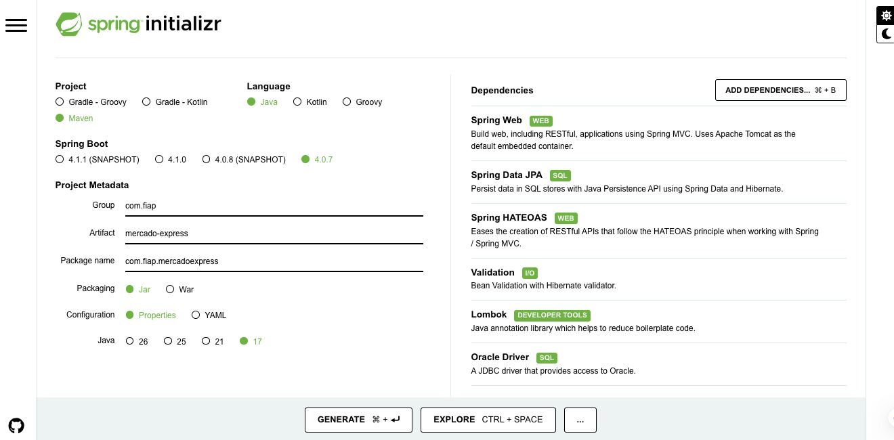
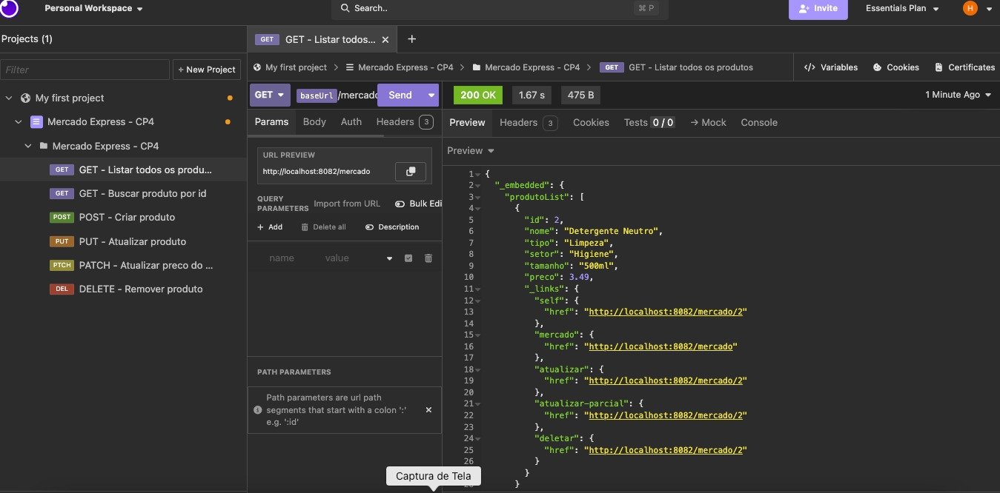
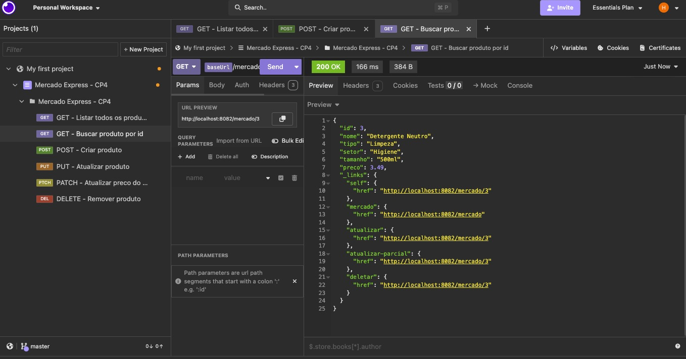
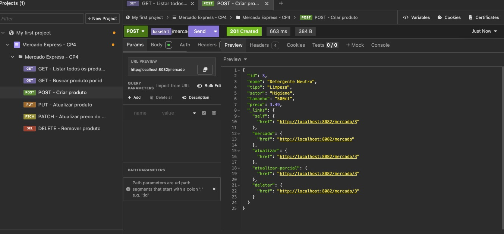
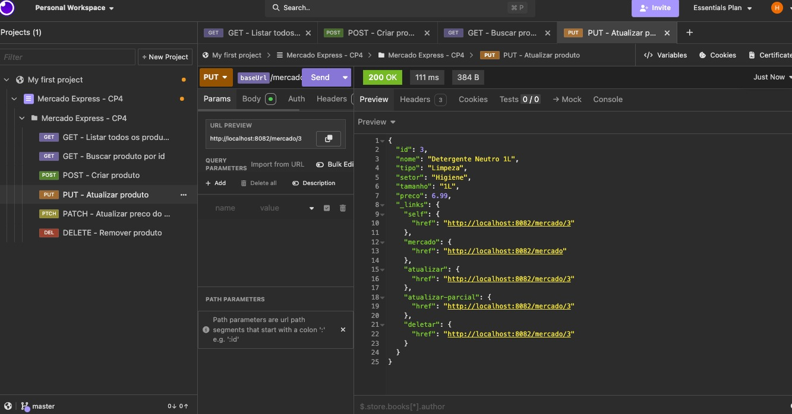
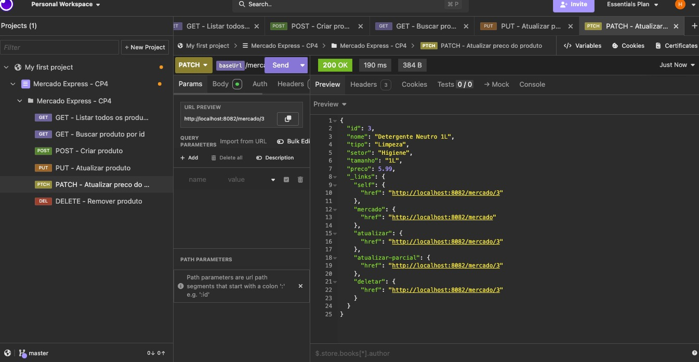
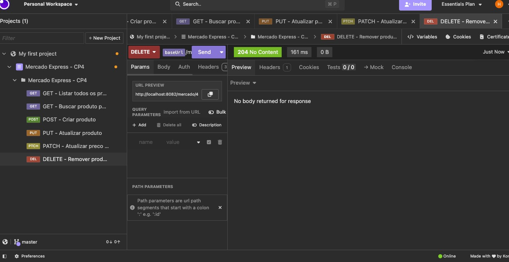

# Mercado Express - API

Trabalho de Checkpoint 4 (Parte 1 - API e Deploy) da disciplina de TDS, FIAP, sob orientação do professor Dr. Marcel Stefan Wagner.

O projeto consiste numa API REST para o controle de estoque de um mercado express (o exemplo adotado foi produtos de limpeza e mercearia, mas a estrutura serve pra qualquer item vendido nesse tipo de loja). A API foi construída em Spring Boot e implementa o CRUD completo - Create, Read, Update e Delete - persistindo os dados numa tabela real no banco Oracle da FIAP, e segue o padrão HATEOAS de nível de maturidade 3, conforme solicitado no enunciado.

A aplicação está publicada e em funcionamento em: https://mercado-express-cp4.onrender.com/mercado

## Integrantes

- Nicolas Monteiro Ramiro - RM 562380
- Marcus Vinicius Vila Nova da Silva - RM 558771
- Hebert Lopes dos Santos - RM 563192

IDE utilizada no desenvolvimento: **IntelliJ IDEA**.

## Tecnologias utilizadas

- Java 17
- Spring Boot 3.3.4, com os módulos Web, Data JPA, HATEOAS e Validation
- Maven
- Lombok, usado na entidade `Produto` para eliminar getters, setters e construtores escritos manualmente
- Oracle Database (SQL Developer / ORACLE_FIAP), acessado via Spring Data JPA
- Docker e Render, para o deploy

Configuração final gerada no Spring Initializr:



## Estrutura de dados

Os produtos são armazenados na tabela `TDS_TB_MERCADO`, criada no Oracle com as colunas exigidas pelo enunciado:

| Coluna  | Tipo          | Descrição                                   |
|---------|---------------|----------------------------------------------|
| ID      | NUMBER        | Identificador do produto, gerado automaticamente |
| NOME    | VARCHAR2(100) | Nome do produto                             |
| TIPO    | VARCHAR2(50)  | Categoria do produto (ex: Limpeza)          |
| SETOR   | VARCHAR2(50)  | Setor do mercado onde o produto fica (ex: Higiene) |
| TAMANHO | VARCHAR2(20)  | Tamanho ou embalagem do produto (ex: 500ml) |
| PRECO   | NUMBER(10,2)  | Preço unitário do produto                   |

A tabela e a sequence do ID (`TDS_SEQ_MERCADO`) são criadas automaticamente pelo Hibernate na primeira execução da aplicação.

## Endpoints

Base: `/mercado`

### GET /mercado

Lista todos os produtos cadastrados.

```json
{
  "_embedded": {
    "produtoList": [
      {
        "id": 1,
        "nome": "Detergente Neutro",
        "tipo": "Limpeza",
        "setor": "Higiene",
        "tamanho": "500ml",
        "preco": 3.49,
        "_links": {
          "self": { "href": "https://mercado-express-cp4.onrender.com/mercado/1" },
          "mercado": { "href": "https://mercado-express-cp4.onrender.com/mercado" },
          "atualizar": { "href": "https://mercado-express-cp4.onrender.com/mercado/1" },
          "atualizar-parcial": { "href": "https://mercado-express-cp4.onrender.com/mercado/1" },
          "deletar": { "href": "https://mercado-express-cp4.onrender.com/mercado/1" }
        }
      }
    ]
  },
  "_links": {
    "self": { "href": "https://mercado-express-cp4.onrender.com/mercado" }
  }
}
```

### GET /mercado/{id}

Busca um produto específico pelo ID.

```json
{
  "id": 1,
  "nome": "Detergente Neutro",
  "tipo": "Limpeza",
  "setor": "Higiene",
  "tamanho": "500ml",
  "preco": 3.49,
  "_links": {
    "self": { "href": "https://mercado-express-cp4.onrender.com/mercado/1" },
    "mercado": { "href": "https://mercado-express-cp4.onrender.com/mercado" },
    "atualizar": { "href": "https://mercado-express-cp4.onrender.com/mercado/1" },
    "atualizar-parcial": { "href": "https://mercado-express-cp4.onrender.com/mercado/1" },
    "deletar": { "href": "https://mercado-express-cp4.onrender.com/mercado/1" }
  }
}
```

Se o ID não existir, retorna `404` com uma mensagem de erro.

### POST /mercado

Cadastra um novo produto. Corpo da requisição:

```json
{
  "nome": "Detergente Neutro",
  "tipo": "Limpeza",
  "setor": "Higiene",
  "tamanho": "500ml",
  "preco": 3.49
}
```

Retorna `201 Created` com o produto já com o ID gerado e os links do HATEOAS.

### PUT /mercado/{id}

Atualiza todos os campos de um produto existente. Corpo igual ao do POST.

```json
{
  "nome": "Detergente Neutro 1L",
  "tipo": "Limpeza",
  "setor": "Higiene",
  "tamanho": "1L",
  "preco": 6.99
}
```

### PATCH /mercado/{id}

Atualiza só os campos enviados no corpo da requisição, sem precisar mandar o produto completo.

```json
{
  "preco": 5.99
}
```

### DELETE /mercado/{id}

Remove o produto do banco pelo ID. Retorna `204 No Content`.

## HATEOAS

Cada resposta da API traz, além dos dados do produto, os links relacionados àquele recurso (`self`, `mercado`, `atualizar`, `atualizar-parcial`, `deletar`), seguindo o nível de maturidade 3 de Richardson: o cliente não precisa saber de antemão a estrutura das URLs, ele navega pelos links retornados pela própria API.

## Testes realizados

Todos os endpoints foram testados no Insomnia, com a aplicação rodando localmente em `localhost:8082` e conectada ao Oracle FIAP de verdade - cada print abaixo mostra o retorno real da API.

**GET /mercado** - lista os produtos cadastrados na tabela:



**GET /mercado/{id}** - busca um produto específico pelo ID:



**POST /mercado** - cadastra um novo produto e retorna 201 Created, já com o ID gerado e os links do HATEOAS:



**PUT /mercado/{id}** - atualiza todos os campos do produto:



**PATCH /mercado/{id}** - atualiza somente o campo enviado (nesse caso, o preço):



**DELETE /mercado/{id}** - remove o produto e retorna 204 No Content:



O arquivo `mercado-express.postman_collection.json`, na raiz do repositório, reúne essas seis requisições já configuradas, com a variável `baseUrl` apontando para a API publicada no Render (para reproduzir os testes localmente, como nos prints acima, basta trocar essa variável para `http://localhost:8082`).

## Deploy

A aplicação está publicada no Render, com build automatizado a partir do `Dockerfile` e do `render.yaml` presentes no repositório - o Render compila o projeto e sobe o serviço sem necessidade de configuração manual de build ou start command, apenas das credenciais de acesso ao Oracle (`DB_USER` e `DB_PASSWORD`), definidas como variáveis de ambiente no próprio Render.

- Aplicação publicada: https://mercado-express-cp4.onrender.com/mercado
- Repositório GitHub: https://github.com/lopesadvisory/mercado-express-cp4

## Executando o projeto localmente

Para rodar a aplicação fora do Render (por exemplo, no IntelliJ), é necessário configurar duas variáveis de ambiente com o acesso ao Oracle FIAP antes de iniciar a classe `MercadoExpressApplication`:

- `DB_USER` - usuário do Oracle FIAP (RM)
- `DB_PASSWORD` - senha do Oracle FIAP

Nenhuma credencial fica salva no código ou no repositório - elas são lidas em tempo de execução a partir dessas variáveis. Com elas configuradas, a aplicação sobe em `http://localhost:8082`.
